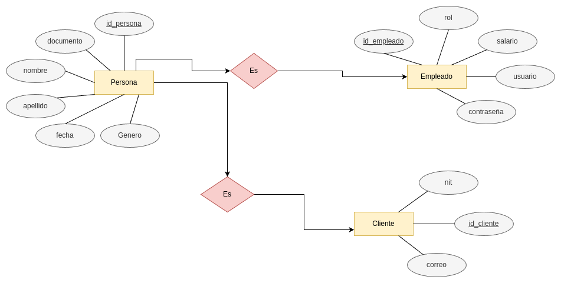
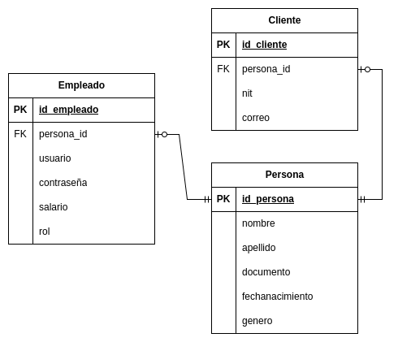
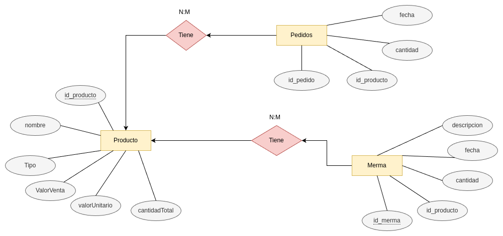
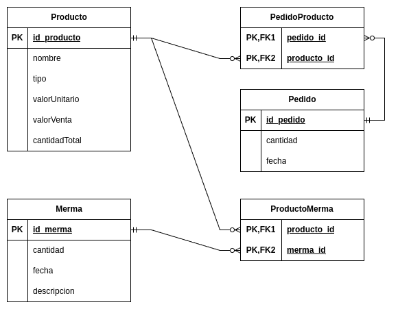
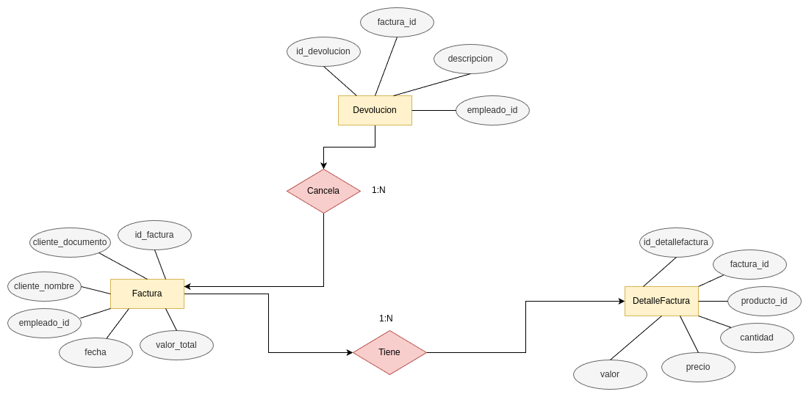
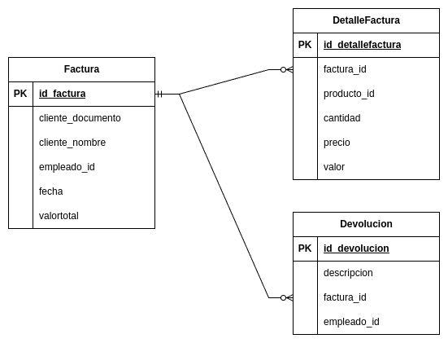

# StockMaster

* StockMaster es un sistema de gestion de inventario, ventas y usuarios para pequeñas empresas, la cual se diseño con un enfoque en microservicios

## PosgreSQL

* Es un sistema de gestion de bases de datos relacional y objeto (RDBMS) de codigo abierto.
* **Instalacion**
    * Para instalar **PosgreSQL** en Linux derivados de ubuntu basta con usar:
    
    ```bash
        sudo apt install posgresql
        sudo apt install posgresql-client
    ```
    * Para acceder a **PosgreSQL** se utiliza:
    
    ```bash
        sudo -u postgres psql
    ```
    * Comandos basicos:
    
    ```bash
        # Listar los Usuarios
        \du
        # Listar las bases de datos
        \l
        # Salir
        \q
    ```
* **Uso de Roles**
    * En **PostgreSQL**, los usuarios y roles son entidades que puede conectarse a la base de datos y realizar operaciones. Un rol puede ser un usuario individual o un grupo de usuarios. Los roles puede tener diferente permisos y priviliegios.
    * **Creacion de un Usuario**
        * Para crear un usuario se usa:
        ```sql
            CREATE USER mi_usuario WITH PASSWORD 'mi_contraseña';
        ```
    * **Creacion de un Rol**
        * Para crear un rol se utiliza:
        ```sql
            CREATE ROLE mi_rol;
        ```
    * **Asignar Permisos a un Rol**
        * Para asignar permisos a un rol se utiliza:
        ```sql
            ALTER ROLE mi_rol CREATEDB;
        ```
    * **Asignar Rol a Usuario**
        * Para asignarle el rol a un usuario se usa el siguiente comando;
        ```sql
            GRANT mi_rol TO mi_usuario;
        ```
    * **Create de un DB**
        * Para crear una base de datos y asignarla a un susario se utiliza:
        ```sql
            CREATE DATABASE mi_base_datos OWNER mi_usuario;
        ```
    * **Ingresar con Usuario Definido**

        * Para ingresar se debe especificar el puerto, el usuario y la base de datos:
        ```sql
            psql -h localhost -p 5432 -U "Mi_usuario" -d data_base;
        ```
    * **Nota**
        * Si se crear usuarios, roles o base de datos con letras en mayusculas se debe usar comillas `""`.

    
## Apis

1. Usuarios (**Sprint 1**)
2. Inventario (**Sprint 1**)
3. Ventas (**Sprint 3**)

### Usuarios

* Para la base de datos de los usuario se creo los siguientes diagramas:

#### Diagrama E-R

<div aling="center">
    
<div>


#### Diagrama Relacional

<div aling="center">
    
<div>

#### Implementacion

1. Creacion de la base de datos:

    ```sql
        CREATE DATABASE "Usuario" OWNER "Gilgamesh";
    ```
2. Creacion de la tabla para ello podemos realizarlo por consola o como lo vamos a hacer utilizando dbeaver.

3. Realizacion de insert de Prueba.


### Inventario

* Para la base de datos del inventario se creo los siguientes diagramas:

#### Diagrama E-R

<div aling="center">
    
<div>

#### Diagrama Relacional

<div aling="center">
    
<div>


#### Implementacion

1. Creacion de la base de datos:

    ```sql
        CREATE DATABASE "Inventario" OWNER "Gilgamesh";
    ```
2. Creacion de la tabla para ello podemos realizarlo por consola o como lo vamos a hacer utilizando dbeaver.

3. Realizacion de insert de Prueba.


### Ventas

* Para la base de datos del inventario se creo los siguientes diagramas:

#### Diagrama E-R

<div aling="center">
    
<div>

#### Diagrama Relacional

<div aling="center">
    
<div>


#### Implementacion

1. Creacion de la base de datos:

    ```sql
        CREATE DATABASE "Ventas" OWNER "Gilgamesh";
    ```
2. Creacion de la tabla para ello podemos realizarlo por consola o como lo vamos a hacer utilizando dbeaver.

3. Realizacion de insert de Prueba.