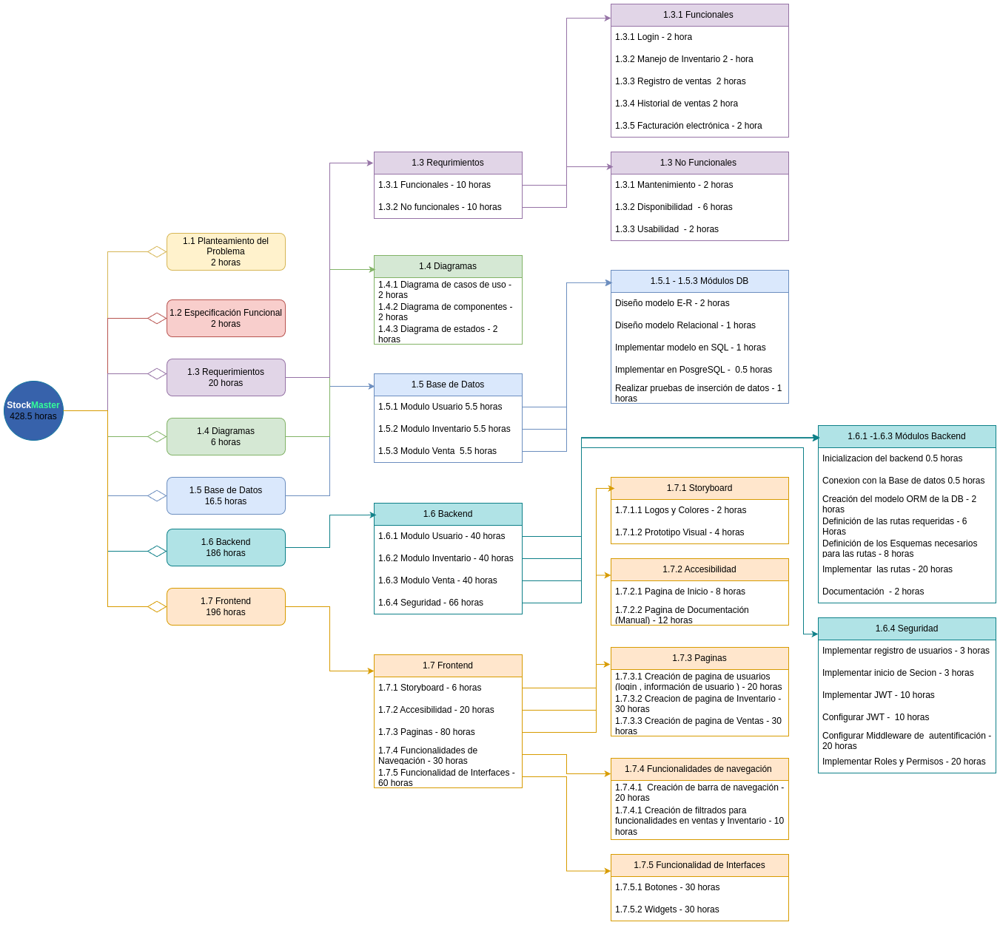

# StocKMaster

    

## Objetivo General del Proyecto

* Producto de software para la gestion de inventario y ventas de empresas pequeñas, el cual permite la gestion de productos, la venta de productos, seguimiento de las actividades realizadas por los empleados y la administracion de la informacion generado por estos.

## Objetivos Especificos Del Proyecto

* **Objetivo 1:** Realizar un sistema de gestion de inventario que permita el registro, seguimiento y control de productos, con alertas automaticas cuando los niveles de stock esten bajos.
* **Objetivo 2:** Ofrecer seguridad de la informacion almacenada por medio de mecanismos de autenticacion y autorizacion para restringir el acceso a funcionalidades.
* **Objetivo 3:** Elaborar los diagrama s de Entidad-Relacion de la base de datos que contendran la informacion del software.
* **Objetivo 4:** Diseñar una interfaz de usuario intuitiva y fácil de usar para la administradora del negocio y el personal, mejorando su experiencia como Usuario y asimilación clara del funcionamiento de la plataforma.
* **Objetivo 5:** Realizar pruebas para garantizar que el sistema sea confiable y cumpla con los requerimientos del cliente.
* **Objetivo 6:** Implemantar la metodología **SCRUM** para garantizar una metidología ágil que garantice que el producto pueda ser llevado a despliegue de manera efectiva.

### Requerimientos Funcionales

* **RF1:** El sistema debe permitir registrar los productos que ingresan al almacén. Se registrará en el ssitema, los nombres de los productos, la cantidad de los productos ingresados y  la fecha de ingreso.
* **RF2:** El sistema debe permitir editar la cantidad de los productos registrados en el inventario en caso de merma o error en la digitacion por parte del personal encargado. En caso de merma debe quedar registrado con fecha.
* **RF3:** El sistema debe ser capaz de guardar la infromacion de los empleados de tal manera que permita al sistema identificar qué funciones puede emplear este y que permisos de acceso tendrá como la vinculación a los proces responsables.
* **RF4:** El sistema debe ser capaz de guardar la informacion del cliente si este la proporciona, en caso de proporcionarla la facturas de las compra realizadas por este cliente debe llevar su informacion, en caso de no porporcionar informacion las facturas debe tener unos datos por default.
* **RF5:** El sistema debe ser capaz de realizar ventas, para ello el sistema debe permitir realizar la búsqueda de los porductos por medio del código,nombre,categoría. Debe ser capaz de mostrar la cantidad de productos y al finalizar la venta debe ser capaz de actualizar la informacion de inventario.
* **RF6:** El sistema debe ser capaz de almacenar el historial de ventas realizadas por el almacen para los respectivos procesos fiscales del negocio o para los reclamos de los clientes para ello debe tener toda la informacion de lav enta realizada y la fecha de registro.
* **RF7:** El sistema debe ser capaz de enviar factura electrónica a los clientes que hayan registrado su informacion en el sistema y que deseen el servicio para ello el sistema debe poder identificar que ventas son de que clientes y utilizar la informacion de este cliente para poder enviar un correo electrónico con la informacion de las compras realizadas.
* **RF8:** El sistema debe ser capaz de proporcionar una interfaz al administrador la cual le muestre la informacion de empleados, inventario, historial de ventas y le permita filtrar la informacion por nombre o por fechas si esta disponible.
* **RF9:** El sistema debe ser capaz de proporcionar alertas por correo electrónico, las cuales el administrador podrá definir esta alertas es referente a los stocks del almacén.

### Requerimientos No Funcionales

* **RNF1:** El sistema debe contar con seguridad de autenticacion para los usuarios.Estos se realizara por medio de un login.
* **RNF2:** El sistema debe contar con alta disponibilidad por lo cual se eligio el uso de la arquitectura de microservicios.
* **RNF3:** El sistema debe poder ser facil de hacer mantenimiento por lo cual se realizara la respectiva documentacion a nivel de codigo, a nivel de rutas y se segiran los estadares de codificacion.
* **RNF4:** El sistema debe cumplir con el requerimiento de usabilidad por lo cual el sistema incorporar uun manual de usuario.

### Diagrama EDT

    

